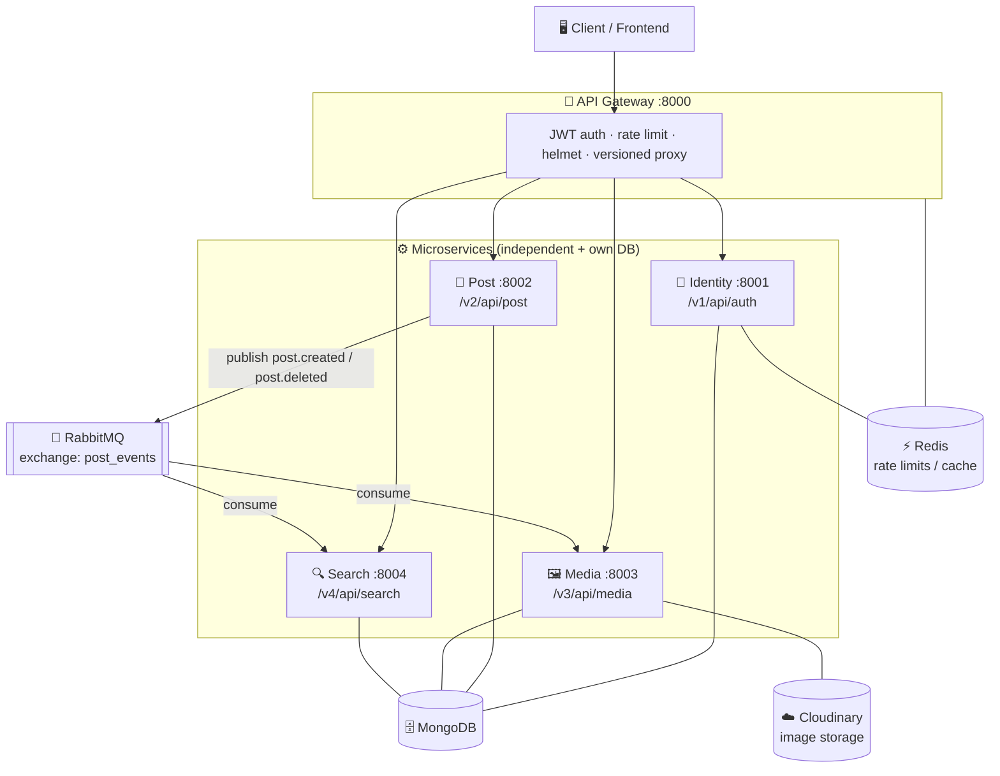

# Social Media — Microservices Backend

> **One line:** A production-style, event-driven microservices backend for a social media platform — where authentication, posts, media, and search each run as independent, individually-scalable services behind a single API gateway.

---

## The business problem we solve

Most social apps start as one big monolith — and then hit a wall as they grow:

- **One crash takes everything down.** If the image-upload code has a bug, login and the feed die with it.
- **You can't scale what's actually hot.** Search and media are expensive and bursty; auth is light. In a monolith you're forced to scale the whole thing, wasting money.
- **Every team steps on every other team.** One giant codebase means slow, risky deploys and constant merge conflicts.
- **Tight coupling makes features fragile.** Deleting a post should also clean up its images and search index — but wiring that synchronously makes requests slow and brittle.

**This project solves that with a microservices architecture.** Each capability — identity, posts, media, search — is its own service with its own database and deploy lifecycle, sitting behind an **API gateway** that handles routing, auth, and rate limiting. Services stay loosely coupled by talking over a **RabbitMQ message bus**: when a post is deleted, an event fans out and the media and search services clean themselves up asynchronously. The result is a backend that scales, fails, and ships **one service at a time** — the way real platforms are built.

## What we provide

| Service | Port | Responsibility |
|---|---|---|
| 🚪 **API Gateway** | 8000 | Single entry point — routing/proxying, JWT auth, rate limiting, security headers, API versioning |
| 🔐 **Identity Service** | 8001 | Register, login, JWT access + refresh tokens, logout, token rotation |
| 📝 **Post Service** | 8002 | Create, read, update, delete posts; publishes post events |
| 🖼️ **Media Service** | 8003 | Image uploads to Cloudinary; deletes media on post deletion |
| 🔍 **Search Service** | 8004 | Full-text post search; keeps its index in sync via events |

**Cross-cutting capabilities baked in:**
- 🔑 **Centralized auth** — JWT verified at the gateway; the trusted `x-user-id` is forwarded to downstream services.
- 🚦 **Redis-backed rate limiting** — protects every service from abuse and spikes.
- 📨 **Event-driven sync** — RabbitMQ (`post_events` exchange) decouples services; a `post.deleted` event triggers media cleanup + search de-indexing.
- 🧾 **Structured logging** — Winston logs (`combined.log` / `error.log`) per service.
- 🐳 **Fully containerized** — one `docker-compose up` spins up all services plus MongoDB, Redis, and RabbitMQ.
- 🔀 **API versioning** — each service is independently versioned (`v1`–`v4`) via the gateway.

---

## Architecture



**How a request flows:** the client hits the **gateway** → gateway verifies the JWT, applies rate limits, rewrites the path to the service's internal version, and proxies it with a trusted `x-user-id` header → the target service does its job against its own MongoDB.

**How services stay in sync (async):** the **Post Service** publishes events to the `post_events` exchange. When a post is deleted, the **Media Service** removes the associated images from Cloudinary and the **Search Service** removes it from the search index — no synchronous calls, no tight coupling.

---

## Tech stack

| Concern | Technology |
|---|---|
| Runtime | Node.js + Express |
| Gateway / proxy | `express-http-proxy`, Helmet, CORS |
| Auth | JWT (access + refresh tokens), bcrypt |
| Databases | MongoDB (Mongoose) — one logical DB per service |
| Cache / rate limiting | Redis (`ioredis`, `rate-limit-redis`, `express-rate-limit`) |
| Messaging | RabbitMQ (`amqplib`) — event-driven communication |
| Media storage | Cloudinary + Multer |
| Logging | Winston |
| Orchestration | Docker + Docker Compose |
| Validation | Joi |

---

## Getting started

### Prerequisites
- **Docker** & **Docker Compose** (recommended path), or
- **Node.js** 18+, **MongoDB**, **Redis**, and **RabbitMQ** running locally
- A **Cloudinary** account (for media uploads)

### Option A — run everything with Docker (recommended)
```bash
git clone <your-repo-url>
cd social-media-microservices
docker-compose up --build
```
This starts MongoDB, Redis, RabbitMQ, and all four services + the gateway. The API is available at **http://localhost:8000**, and the RabbitMQ management UI at **http://localhost:15672**.

### Option B — run each service manually
Each service is a standalone Node app. In separate terminals:
```bash
cd api-gateway     && npm install && npm run dev
cd identity-service && npm install && npm run dev
cd post-service     && npm install && npm run dev
cd media-service    && npm install && npm run dev
cd search-service   && npm install && npm run dev
```

### Environment variables
Each service has its own `.env`. Typical values:

**`api-gateway/.env`**
```env
PORT=8000
NODE_ENV=development
IDENTITY_SERVICE_URL=http://localhost:8001
POST_SERVICE_URL=http://localhost:8002
MEDIA_SERVICE_URL=http://localhost:8003
SEARCH_SERVICE_URL=http://localhost:8004
AUTH_VERSION=v1
POST_VERSION=v1
MEDIA_VERSION=v1
SEARCH_VERSION=v1
ACCESS_TOKEN_SECRET=your_access_secret
REFRESH_TOKEN_SECRET=your_refresh_secret
REDIS_URL=redis://localhost:6379
FRONTEND_URL=http://localhost:3000
```

**Each backend service `.env`** (identity / post / media / search)
```env
PORT=800x
NODE_ENV=development
VERSION=v1
MONGODB_URL=mongodb://localhost:27017/social-media
REDIS_URL=redis://localhost:6379
RABBITMQ_URL=amqp://localhost:5672
ACCESS_TOKEN_SECRET=your_access_secret
REFRESH_TOKEN_SECRET=your_refresh_secret
FRONTEND_URL=http://localhost:3000

# media-service only
CLOUDINARY_CLOUD_NAME=your_cloud_name
CLOUDINARY_API_KEY=your_api_key
CLOUDINARY_API_SECRET=your_api_secret
```
> When running under Docker Compose, use the service names as hosts (e.g. `mongodb://mongo:27017`, `redis://redis:6379`, `amqp://rabbitmq:5672`).

---

## API overview

All requests go through the gateway at `http://localhost:8000`. Everything except auth requires a valid JWT.

| Service | Endpoint (via gateway) | Method | Purpose |
|---|---|---|---|
| **Auth** | `/v1/api/auth/register` | POST | Create an account |
| | `/v1/api/auth/login` | POST | Log in, receive access + refresh tokens |
| | `/v1/api/auth/refreshToken` | POST | Rotate the access token |
| | `/v1/api/auth/logout` | POST | Invalidate the refresh token |
| **Posts** | `/v2/api/post/create-post` | POST | Create a post (with optional media) |
| | `/v2/api/post/get-All-posts` | GET | List posts |
| | `/v2/api/post/get-post/:id` | GET | Get a single post |
| | `/v2/api/post/update-post/:id` | PUT | Update a post |
| | `/v2/api/post/delete-post/:id` | DELETE | Delete a post (fans out cleanup events) |
| **Media** | `/v3/api/media/upload-media` | POST | Upload an image to Cloudinary |
| | `/v3/api/media/get-all-media` | GET | List uploaded media |
| **Search** | `/v4/api/search/search-post` | POST | Full-text search across posts |

---

## Project structure

```
social-media-microservices/
├── docker-compose.yml        # MongoDB, Redis, RabbitMQ + all services
├── api-gateway/              # single entry point (routing, auth, rate limit)
├── identity-service/         # auth, JWT access/refresh tokens
├── post-service/             # posts CRUD + event publishing
├── media-service/            # Cloudinary uploads + event consumption
└── search-service/           # post search + index sync via events
    └── src/
        ├── controllers/      # request handlers
        ├── routes/           # service routes
        ├── models/           # Mongoose schemas
        ├── middleware/       # auth, rate limiting, API versioning
        ├── eventHandlers/    # RabbitMQ consumers
        ├── utils/            # rabbitmq, logger
        ├── database/         # MongoDB + Redis connections
        └── server.js         # service entry point
```

---

## Roadmap ideas
- Service health checks and a centralized metrics/monitoring dashboard
- Dead-letter queues and retries for failed event handling
- Notification service (likes, comments, follows)
- Follow/feed service with a personalized timeline
- CI/CD pipeline and Kubernetes manifests for production scaling

---

Built with ❤️ to show how a social platform scales — one service at a time.
